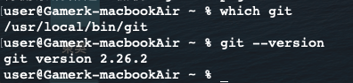

# 1st_0927

## Git & Linux

Git 是一種基於Linux命令的版本控制工具。

### Git

- pros
    - 免費、開源
    - 分散式系統
    - 可地端工作
- Git Hub 簡介

### Linux

- pros
    - 穩定的系統
    - 相對較不耗資源
    - 適合需要小核心的嵌入式系統
    

## Git語法

```bash

```

